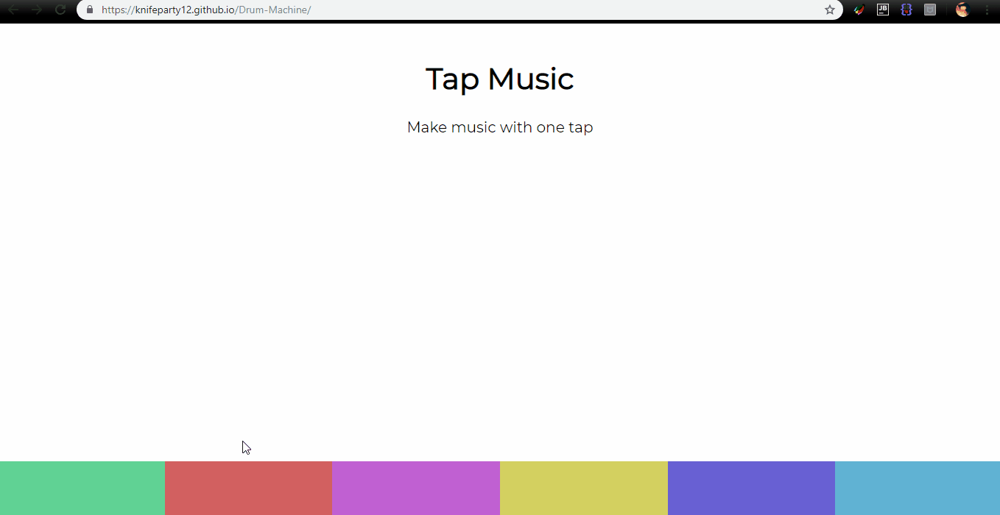

# Drum-Machine

### Implement an audio track and add different sounds to it using Vanilla JS i.e basically a drum machine.

> ## Deployment :: [Github pages](https://knifeparty12.github.io/Drum-Machine/)

  

 

> No Audio in GIF :grinning: 

